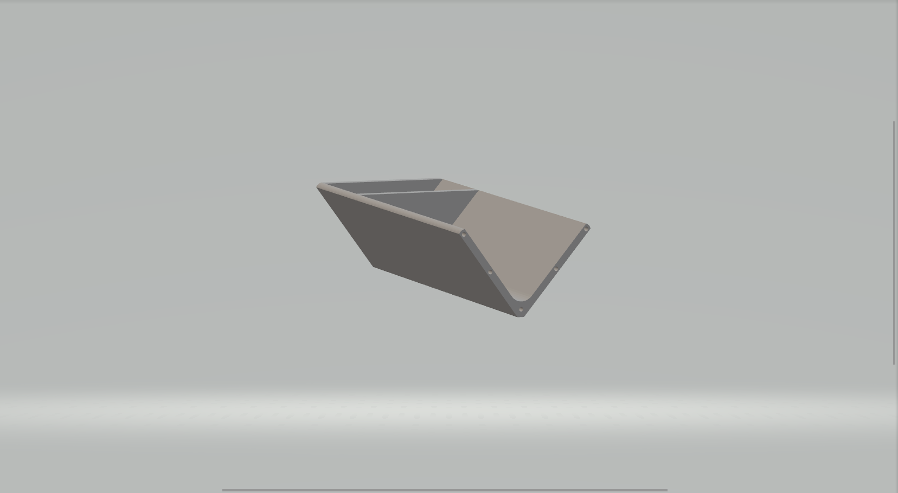
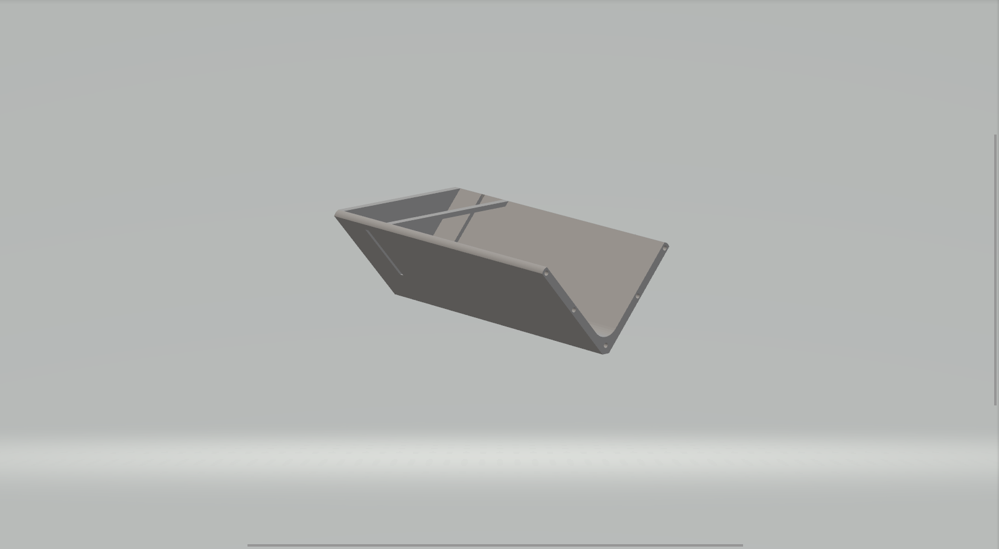
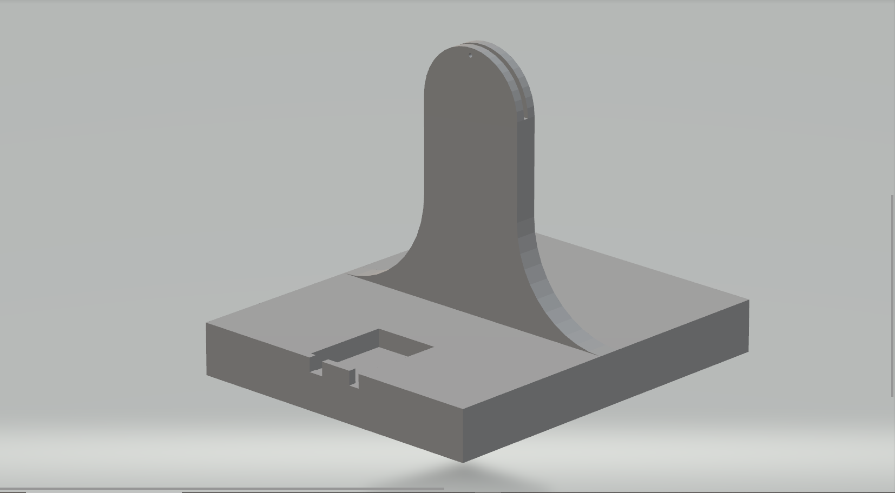
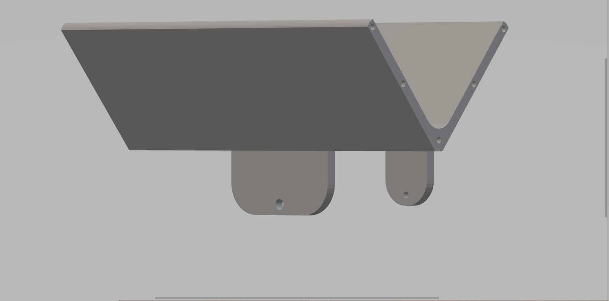

# Demonstração de um Sistema de Controle P.I.D.  ⚖
### Por: Instituto Federal de Minas Gerais - Campus Ibirité
### Participantes:
* [Professor Ismael Melo](https://www.youtube.com/@ismaelmelo9766/featured)
* [Pietro Schuster Moreira](https://github.com/Schusteerr)
* [Thallyta Mariana Cordeiro]()
* [Kauan Fernandes]()
* [Yuri Fernandes]()

##

## Introdução 📃

Este projeto visa criar uma facilidade para o entendimento de um Sistema de Controle P.I.D. para os alunos do Ensino Médio principalmente, assim como estipular a criatividade para o desenvolvimento de projetos parecidos, servindo como um ponto de vista de uma prática educacional no contexto relacionado à Engenharia e Automação, especialmente em aplicações Robóticas e de Controle de Máquinas.

A prática consiste em demonstrar um Sistema de Controle P.I.D. de baixo custo pelos alunos. Na educação, o sistema P.I.D. é frequentemente ensinado em cursos de Engenharia, Ciência da Computação e Automação. Ele é utilizado em Laboratórios de Controle e Automação, onde os estudantes podem aprender como projetar e implementar sistemas de controle utilizando o P.I.D. em diferentes aplicações, como robôs, máquinas de produção, sistemas de transporte, entre outros.

Espera-se que o projeto possa facilitar o entendimento sobre tal funcionamento, a partir da observação de um sistema simples, como o montado, que então possa pensar em aplicações ou funcõs similares a que possa ser utilizado, isso, claro, tendo conhecimento prévio sobre.

 

## Desenvolvimento do Projeto 🛠
 
O projeto foi desenvolvido afins disciplinares contando com quarto alunos, todos do curso técnico (PIBEX-Jr) do campus Ibirité. A metodologia do projeto pode ser divida em quatro macro atividades:

(i) planejamento de um protótipo: serão desenvolvidos os circuitos eletrônicos e o projeto 3D de um protótipo inicial.

(ii) validação do protótipo: testes de impressão do protótipo e, a partir desses testes, realizar melhorias no protótipo.

(iii) validação dos circuitos eletrônicos e programação: elaboração de uma lógica de programação para garantir o funcionamento correto do circuito e chegar num resultado final aceitavel.

(iv) avaliação do projeto: Com a avaliação final do projeto, terá fim de ser usado para exibição à outros alunos, afim de replicar algo similar em outras atividades, assim como usa-lo como material didático.

 

## Protótipo 3D 🏗

Uma ideia inicial para demonstrar como que um Sistema de controle P.I.D. (Proporcional, Integral e Derivativo) funciona em prática foi adotar um modelo de "Balança", isso com base em pesquisas realizadas para saber o que a maioria considera mais fácil à entendimento. Seu funcionamento se dá a partir de sensores garantirem que uma bola fique centrada no meio de uma "Régua", que esta em constante movimento rotativo em torno de seu próprio eixo com base no deslocamento da bola. 

O Protótipo 3D foi feito pelos alunos, a partir um modelo base contruído, citado no vídeo abaixo:

* [PID Balance+Ball | full explanation & tuning](https://www.youtube.com/watch?v=JFTJ2SS4xyA)

Tendo em vista esse modelo de base, foi decidido que teria que compor uma base, que irá comportar um Arduino UNO e um Motor, assim como uma haste que comportaria a então Régua, onde nela é encaixado o Sensor de Distância para colocar em ação o controle do balanço. Como resultado teve-se seguinte:

* Duas pontas da Régua, uma contendo encaixe para sensor:
<pre>

    
    Ponta da Régua com uma parede para ficar equivalente ao furo do sensor na outra ponta
    
    
    Ponta com encaixe para sensor, com uma barreira para evitar impacto ao mesmo

</pre>

* Base contendo um encaixe para um Arduino UNO e o meio da Régua, o mesmo que conecta as duas pontas da Régua

<pre>

    
    Base, com encaixe projetado para um Arduino

    
    Meio da Régua, com duas hastes, uma para Base e outra para o Motor

</pre>

 

## Componentes ⚙

Sobre os componentes, seguindo a refência que tinhamos, usamos um Arduino do tipo UNO para programar o sistema do P.I.D., que controla um Servo Motor FUTABA S3003, isso com base nas informações obtidas pelo sensor de distância HC-SR04, como demonstrado abaixo:

~~~ino
#define pino_trigger 4 //define as entradas de dados do sensor
#define pino_echo 5
const int servoP = A0; //informa em quais portas do arduino o motor está conectado
const int servoI = A1;
const int servoD = A2;
~~~
~~~ino
float kp=8; //kp, ki e kd são as respectivas váriáveis para valores de P.I.D.
float ki=0.02; 
float kd=3100; 
float distance_setpoint = 25; //Setpoint define o comprimento total da Régua para ter noção do meio
~~~
~~~ino
//crio duas variaveis para fazer a conversão da leitura do sensor para centímetros
float cmMsec; 
float distance = 0.0;
//faço a conversão
long microsec = ultrasonic.timing();
cmMsec = ultrasonic.convert(microsec, Ultrasonic::CM);
//crio variaveis para a distancia do centro
float distance_previous_error, distance_error;
//informo a distância obtida em centimetros   
distance = cmMsec;   
//agrego a distancia do centro a partir do comprimento da Régua - distancia obtida
distance_error = distance_setpoint - distance;   
//com base na distancia do centro são feitas as conversões para P.I.D.
PID_p = kp * distance_error;
float dist_diference = distance_error - distance_previous_error;     
PID_d = kd*((distance_error - distance_previous_error)/period);
      
if(-13 < distance_error && distance_error < 13)
{
    PID_i = PID_i + (ki * distance_error);
}
else
{
    PID_i = 0;
}
  
PID_total = PID_p + PID_i + PID_d;  
//quando o P.I.D. total é gerado eu mapeio em paralelo aos seguintes valores
PID_total = map(PID_total, -150, 150, 0, 150);
//esses valores vão me informar o quanto o meu motor precisa rotacionar, em algulo, para que a bola fique no centro da régua
if(PID_total < 20){PID_total = 20;}
if(PID_total > 160) {PID_total = 160; } 
  
myservo.write(PID_total+20);
distance_previous_error = distance_error;
~~~

## Notas Finais 📜

- O código encontrado aqui não é o final, pois posteriormente foram feitas alterações em pequenos detalhes, como a sensibilidade do P.I.D. e Ângulo de trabalho do Motor, pois isso é relativo à posição em que é utilizado.
- Posteriormente foram colocados potênciomentros para alterar os valores de P.I.D. dentro de uma escala expecífica, para demonstrar como que cada um deles funciona individualmente e o que alteram no controle da balança.

- O resultado obtido foi capaz de manter a bola no centro da régua, mas claro, dependendo dos níveis de P.I.D. colocados.

 

## Referências 🔎

Electronoobs. [PID Balance+Ball | full explanation & tuning](https://www.youtube.com/watch?v=JFTJ2SS4xyA). YouTube, 14 jul. 2019.

ELECTRONOOBS. [Arduino PID ping pong balance servo IR distance sensor](http://electronoobs.com/eng_arduino_tut100.php). 2019.

